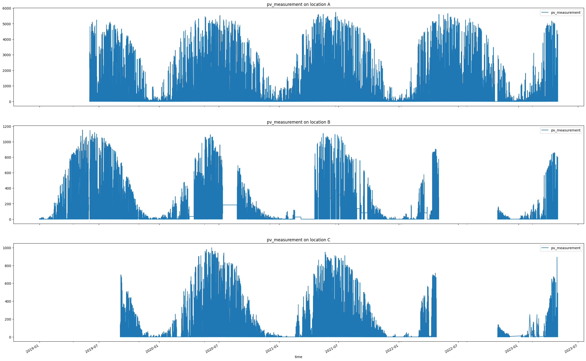

# Solar Energy Production Forecasting - Competition

The project description and data can be found on [Kaggle](https://www.kaggle.com/competitions/solar-energy-production-forecasting)

# Solar Datahead Forecast Data

The dataset provides data for evaluating solar production dayahead forecasting methods.
The dataset contains three locations (A, B, C), corresponding to office buildings with solar panels installed.
There is one folder for each location.

There are 4 files in each folder:

1. train_targets.parquet - target values for the train period (solar energy production)
2. X_train_observed.parquet - actual weather features for the first part of the training period
2. X_train_estimated.parquet - predicted weather features for the remaining part of the training period
2. X_test_estimated.parquet - predicted weather features for the test period

Baseline and targets production values have hourly resolution.
Weather has 15 min resolution.
Weather parameter descriptions can be found [here](https://www.meteomatics.com/en/api/available-parameters/alphabetic-list/).

There is a distinction between train and test features.
For training, we have both observed weather data and its forecasts, while for testing we only have forecasts.
While file `X_train_observed.parquet` contains one time-related column `date_forecast` to indicate when the values for the current row apply,
both `X_train_estimated.parquet` and  `X_test_estimated.parquet` additionally contain `date_calc` to indicate when the forecast was produced.
This type of test data makes evaluation closer to how the forecasting methods that are used in production.
Evaluation measure is [MAE](https://en.wikipedia.org/wiki/Mean_absolute_error).

# Our final submission

The final report with all the code details can be found on [`final_notebook.ipynb`](final_notebook.ipynb).

On `rsc` folder we displayed some results after running `final_notebook.ipynb`.

For instance, the data that we had for the three locations were looking like that:

