# Solar Energy Production Forecasting - Competition

The project description and data can be found on [Kaggle](https://www.kaggle.com/competitions/solar-energy-production-forecasting).

# Solar Datahead Forecast Data

The dataset provides data for evaluating solar production dayahead forecasting methods.
The dataset contains three locations (A, B, C), corresponding to office buildings with solar panels installed.
There is one folder for each location.

There are 4 files in each folder:

1. train_targets.parquet - target values for the train period (solar energy production)
2. X_train_observed.parquet - actual weather features for the first part of the training period
2. X_train_estimated.parquet - predicted weather features for the remaining part of the training period
2. X_test_estimated.parquet - predicted weather features for the test period

Baseline and targets production values have hourly resolution.
Weather has 15 min resolution.
Weather parameter descriptions can be found [here](https://www.meteomatics.com/en/api/available-parameters/alphabetic-list/).

There is a distinction between train and test features.
For training, we have both observed weather data and its forecasts, while for testing we only have forecasts.
While file `X_train_observed.parquet` contains one time-related column `date_forecast` to indicate when the values for the current row apply,
both `X_train_estimated.parquet` and  `X_test_estimated.parquet` additionally contain `date_calc` to indicate when the forecast was produced.
This type of test data makes evaluation closer to how the forecasting methods that are used in production.
Evaluation measure is [MAE](https://en.wikipedia.org/wiki/Mean_absolute_error).

# Our final submission

The total final report with all the code details can be found on [`final_notebook.ipynb`](final_notebook.ipynb). This section is only allocated to provides the main plots we had.

On [`rsc`](./rsc) folder we displayed some results after running [`final_notebook.ipynb`](final_notebook.ipynb).

For instance, the data that we had for the three locations were looking like that:

## 1. Data analysis

We noticed a high correlation between the three locations:

`correlation between A and B of pv_measurement: 0.848312308309505
corrélation between A and C of pv_measurement: 0.9257933955622683
corrélation between B and C of pv_measurement: 0.8771619108144573`

We sorted the variables by categories:

|Sun-related variables|Snow-related variables|Atmospheric pressure variables|Rain variables|Wind variables|Cloud-related variables|Visibility and altitude variables|Variables related to diffuse and direct light|Day/night and shade variable|
|--- |:-: |:-: |:-: |:-: |:-: |:-: |:-:   |--:   |
|`clear_sky_energy_1h:J`|`fresh_snow_12h:cm`|`msl_pressure:hPa`|`precip_5min:mm`|`wind_speed_10m:ms`|`effective_cloud_cover:p`|`ceiling_height_agl:m`|`diffuse_rad:W`|`is_day:idx`|
|`clear_sky_rad:W`|`fresh_snow_1h:cm`|`pressure_100m:hPa`|`rain_water:kgm2`|`wind_speed_u_10m:ms`|`total_cloud_cover:p`|`elevation:m`|`diffuse_rad_1h:J`|`is_in_shadow:idx`|
|`sun_azimuth:d`|`fresh_snow_24h:cm`|`pressure_50m:hPa`|`prob_rime:p`|`wind_speed_v_10m:ms`|`relative_humidity_1000hPa:p`|`visibility:m`|`direct_rad:W`||
|`sun_elevation:d`|`fresh_snow_3h:cm`|`sfc_pressure:hPa`|`precip_type_5min:idx`||`absolute_humidity_2m:gm3`||`direct_rad_1h:D`||
|`sun_elevation:d`|`fresh_snow_6h:cm`|`t_1000hPa:K`|`dew_or_rime`||`air_density_2m:kgm3`||||
||`snow_density:kgm3`|`wind_speed_w_1000hPa:ms`|`dew_point_2m`||`cloud_base_agl:m`||||
||`snow_depth:cm`||||||||
||`snow_drift:idx`||||||||
||`snow_melt_10min:mm`||||||||
||`snow_water:kgm2`||||||||
||`super_cooled_liquid_water:kgm2`||||||||

We also noticed some strong depedencies between the different inputs:

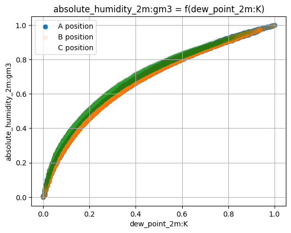
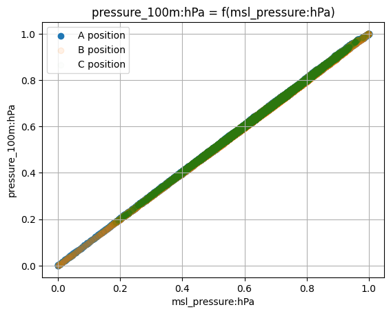
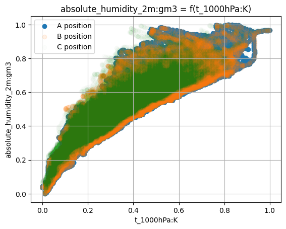
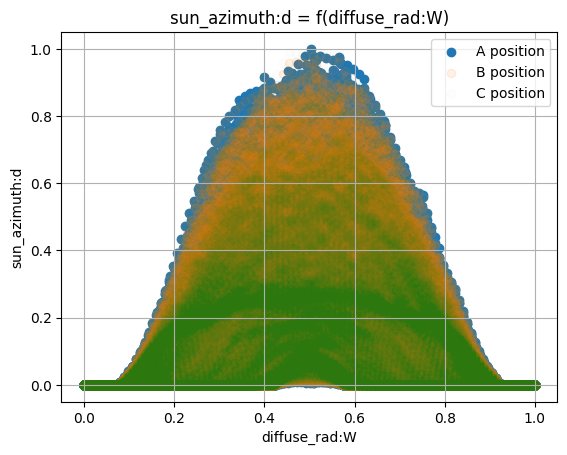

Hence we looked to some correlation matrix:

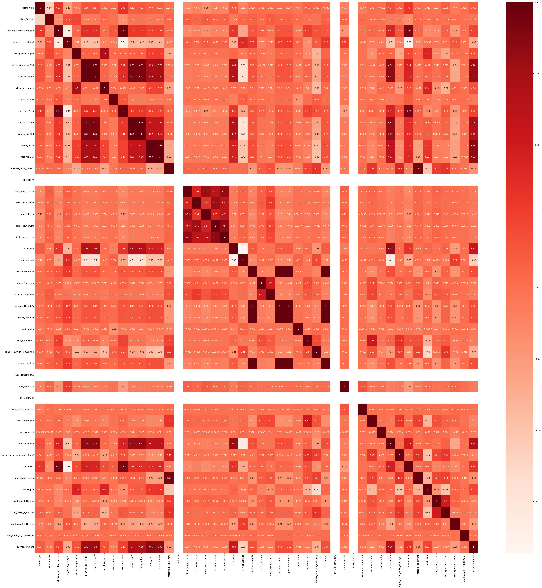

## 2. Signal analysis based models

Because our data were presenting some periodicities, intuitively, one of our first idea were to analyse the different signals we have, starting by our target, `pv_measurement`.

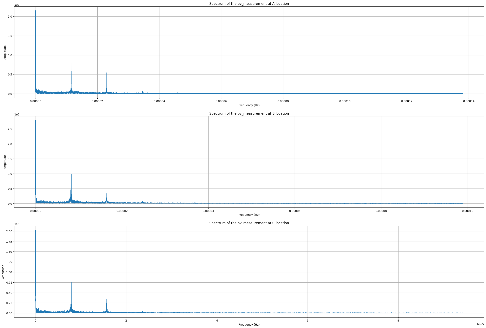
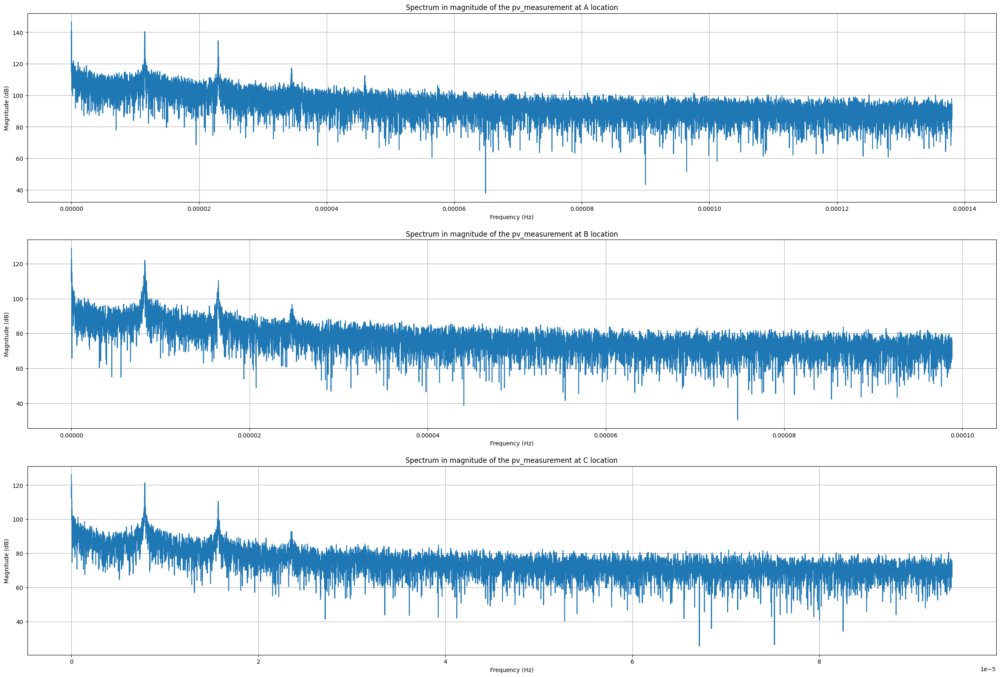

We know from the analysis of the nan values that A got the most clean datas in term of `pv_measurement` values. So our analysis will mostly be based on what we see on A. We can notice 3 most important frequencies: one for the year, one for the day and one for a half-day (12 hours). If we look more on the frequency plot, we can notice a most little one frequency (that our threshold impeach us to read it on the last print). This seems to be a peak for a period of 8 hours, according to the code cell bellow.

Because B and C are not much clean, we can suppose that the big differencies we found with A comes from the Nan values, which create some empty cells in these frames, which are compensated by increasing the frequency values. However, we did not pay attention to it much at first be because most of our analysis were based on A data.

We can confirm what we sayied on B and C compared to A if we look on the differents sampling rates depending on the situation. Theorically, it should be close to one hour ($=3600$ seconds) because our values are measured every hours. But if we look on `1 / sampling_rates['B']` and `1 / sampling_rates['C']` we see that it's more than it for B and C locations. This comes from Nan values and confirms our point above.

We can notice that `1 / sampling_rates['B']` is a bit bigger than an hour. We can explain it by the gap of one week between `X_train_observed_a` and `X_train_estimated_a`, which exists as well in `train_a`.

Now the idea is to keep only the most important frequencies in order to have a model which can be written like this:
$$y[n] = \hat{y}[n] + r[n]$$

where $n$ is the index of the output, $y[n]$ is the real value of `pv_measurement` at index $n$ (or time $t$), $\hat{y}[n]$ is the value at index $n$ of the signal filtered predicted by signal analysis and $r[n]$ is the value at index $n$ of the noise created by mostly, the weather, from our inputs `X_train_estimated`, `X_train_observed`, etc. It would be design by a machine learning model. Actually we did not had the time to test this feature entirely, because of a lack of time our goals priotization. So, it is not entirely designed, but we will detail as far as we came to it.

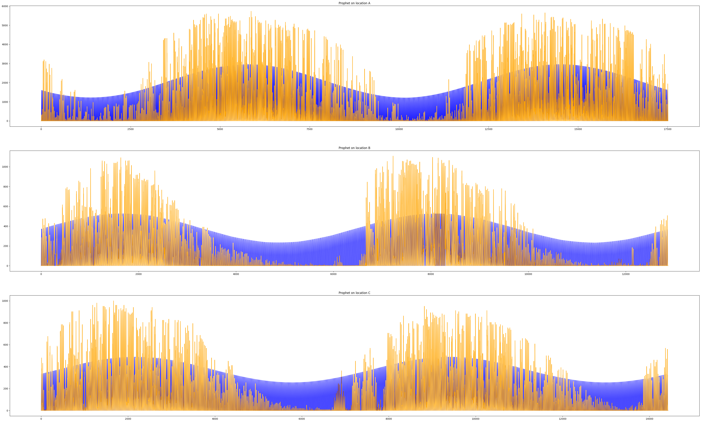

However, we explored different ways to design $\hat{y}[n]$. The first one is a raw filter on the whole signal. This method were not much efficient. In our researchs we found `prophet`, a Python (and R) library which gives a procedure for forecasting time series data based on an additive model where non-linear trends are fit with yearly, weekly, and daily seasonality, plus holiday effects. It works best with time series that have strong seasonal effects and several seasons of historical data. Prophet is robust to missing data and shifts in the trend, and typically handles outliers well.

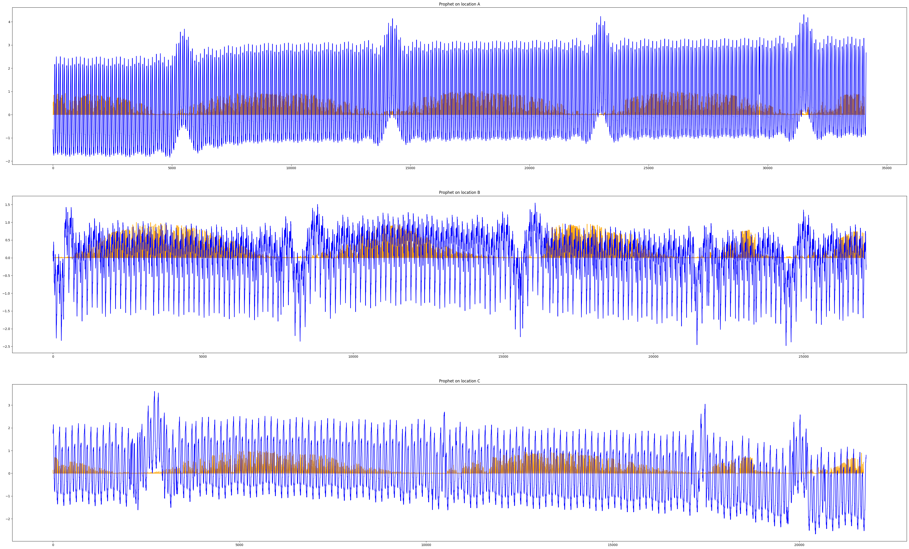

This results, from prophet and the filter signal, are not really satisfying. Then came the idea, inpired by [this paper](https://peerj.com/preprints/3190.pdf), to see what's happen if we plot one signal for each hour (it would make $24 * 3 = 72$ models). We then first split our signals by hours and plot what we get with prophet prediction and our filter.

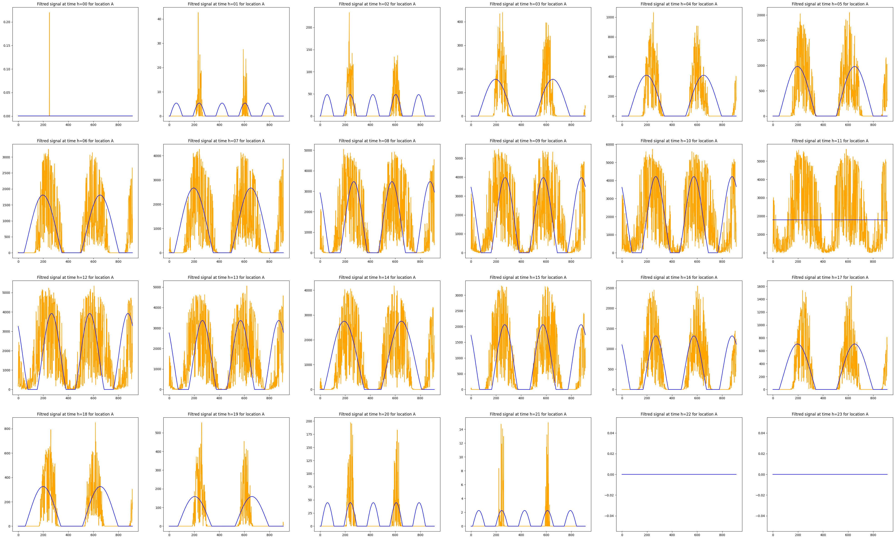
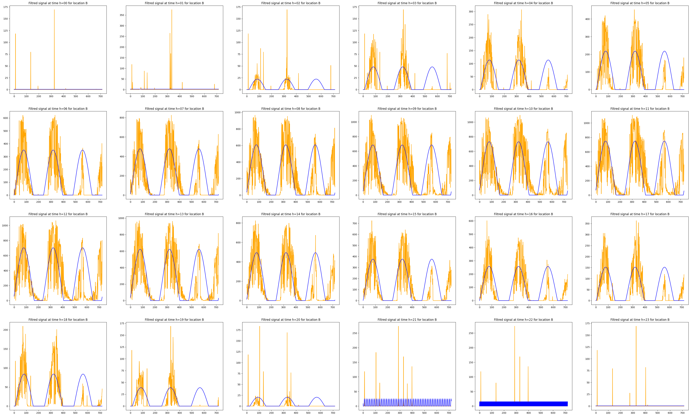
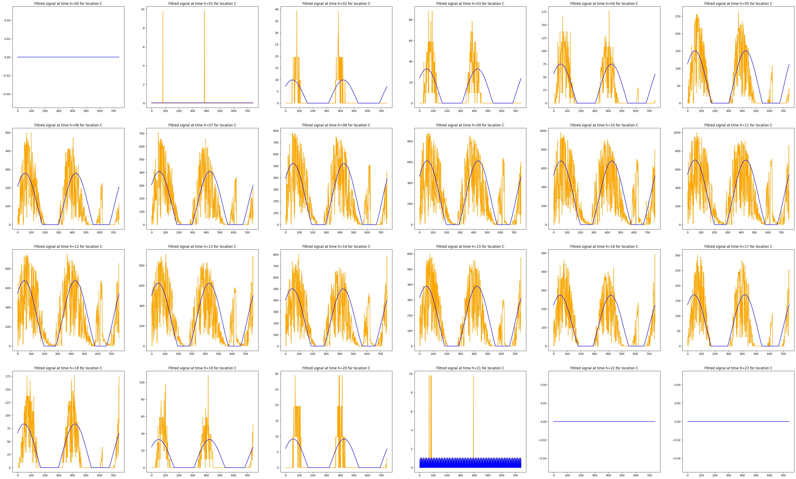

We then reconstructed the whole signal:

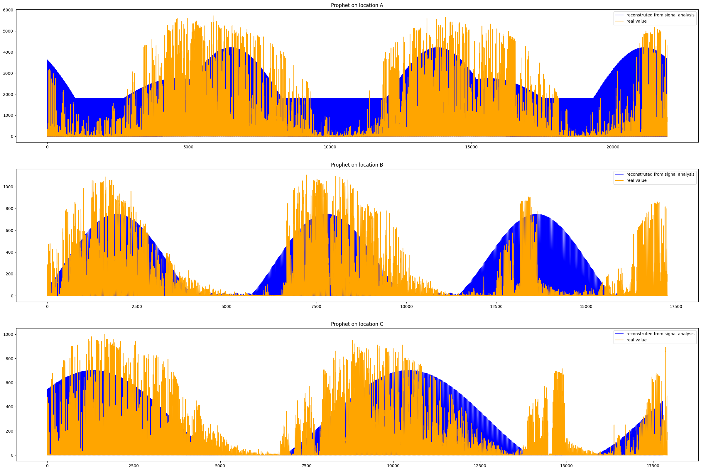

We get here a far more satisfying result. There is a problem for A, we did not get why the curve does not go to 0 value.

We then decided to use the same method using prophet.

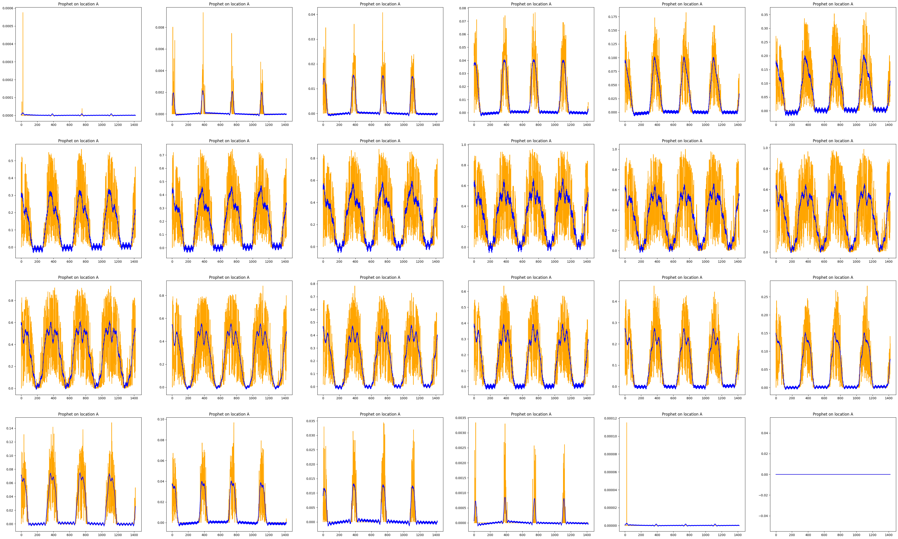
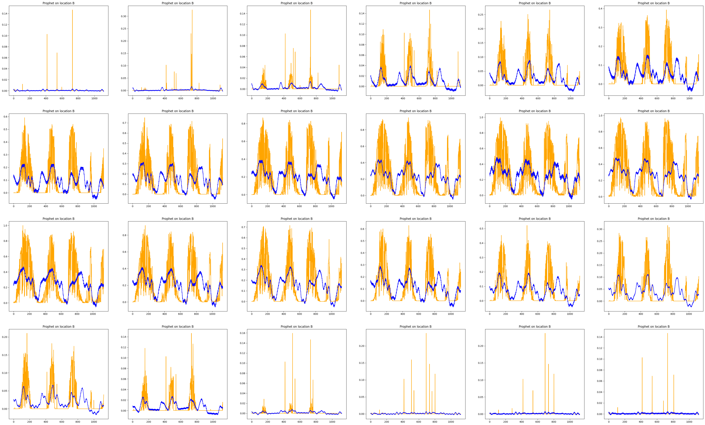
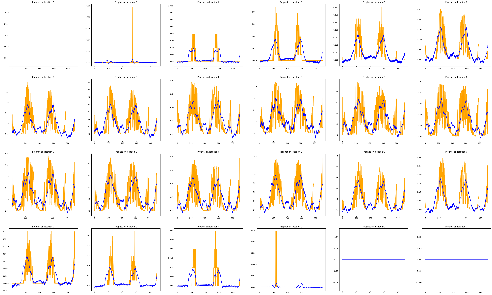

We get then the prophet reconstruction:

We did not found much successful results on it. The curve obtained were not that bad but we did not had much time to merge this with the biggest model. Maybe this approach were to much complicated as a first one and we should have focus on it later. From now, we consider it as a way to upgrade our current model that we are going to present in the next parts.